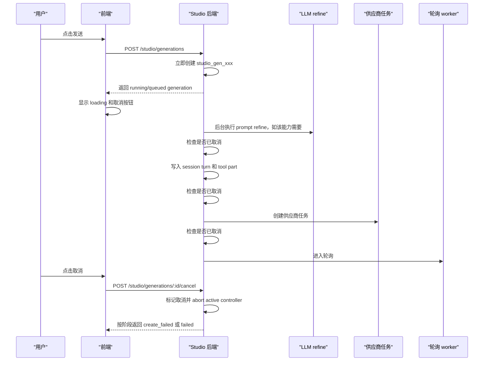

# Studio 全链路取消生成改造方案

## 背景

当前 Studio 生成链路中，`image.generate` 和 `video.generate` 会先走 LLM prompt refine，再创建真实供应商任务。用户点击发送后，前端会先创建一个本地 `studio_pending_xxx`，但后端真实 `studio_gen_xxx` 要等 LLM refine 和部分创建流程完成后才返回。

这导致两个取消入口行为不一致：

- `studio-composer-stop` 在 LLM 阶段虽然可以显示，但只能清理前端本地 pending，不能停止后端 LLM refine，也不能阻止后续创建供应商任务。
- `studio-result-card` 的取消按钮依赖真实 generation id，LLM 阶段没有真实 id，因此无法真正取消。

目标是：用户点击发送后，取消按钮立即可用，并且无论当前处于 LLM refine、创建供应商任务、排队、运行还是轮询阶段，都能取消同一条生成流程。

## 能力覆盖范围

必须覆盖所有 Studio 生成能力：

- `image.generate`
  - 默认会走 LLM prompt refine。
  - `extra.skipPromptRefine === true` 时不走 LLM，例如再次生成、恢复输入等。
- `video.generate`
  - 当前已接入 prompt refine，也应按同一条全链路取消处理。
- `image.upscale`
- `image.cutout`
- `image.inpaint`
- `image.outpaint`
  - 这些编辑类能力不走 LLM refine，但仍走同一个 `createGeneration` 和供应商任务创建链路。
- `image.fusion`
  - 类型里已存在，应避免新的取消逻辑只按图片/视频二分写死。即使当前入口未完整开放，也应按普通生成链路兼容。

关键原则：取消逻辑不能依赖“是否走 LLM”。所有能力都应该从一开始拥有真实 `studio_gen_xxx`，并由同一个 `cancelGeneration` 入口取消。

## 当前问题

### 前端

文件：

```text
packages/app/octoapp/pages/studio-page.tsx
```

当前发送逻辑：

```ts
setPendingResult({
  id: `studio_pending_${Date.now()}`,
  status: "running",
  images: [],
})

const generation = await createStudioGeneration(...)
setPendingResult(generation)
```

在 `await createStudioGeneration(...)` 返回前，前端只有本地临时 id。`pollingGenerationID()` 会过滤掉非真实 generation id：

```ts
if (!isStudioGenerationID(active.id)) return
```

所以 LLM 阶段点击取消时，`handleCancelGeneration()` 无法调用后端取消接口，只能：

```ts
generationToken++
setPendingResult(undefined)
setStatus("idle")
setSending(false)
```

这只是前端状态取消，不是全链路取消。

### 后端

文件：

```text
packages/opencode/src/studio/studio-service.ts
```

当前 `createGeneration` 是同步长流程：

```ts
const promptRefine = await refineStudioPrompt(input, session)
const id = Identifier.create("studio_gen", "ascending")
persistStudioSession(...)
db.insert(StudioGenerationTable).values(...)
const created = await createProviderTask(...)
return generationSnapshot(record)
```

问题：

- LLM refine 前没有 `studio_gen_xxx`。
- LLM refine 前没有 DB record。
- cancel 接口查不到 generation。
- cancel 接口当前要求 `provider_task_id`，无法取消 pre-provider 阶段。
- HTTP route 没有把请求 abort signal 传给 `createGeneration` 或 `refineStudioPrompt`。

## 推荐方案

采用“先创建 generation，后异步执行 pipeline”的状态机方案。

### 新流程



### 状态选择

当前数据库状态只有：

```ts
"queued" | "running" | "succeeded" | "create_failed" | "failed"
```

推荐第一阶段不新增数据库枚举，避免迁移和前端类型扩散。

兼容方案：

- LLM refine 阶段：使用 `running`。
- 供应商任务创建前：`provider_task_id` 为空。
- 取消后按是否已经拿到最终生成接口返回的 `task_id` 分状态：
  - 尚未拿到 `task_id`，也就是还没完成最终生成接口调用：`create_failed + raw_status = "4" + error = "用户取消生成"`。
  - 已经拿到 `task_id`，也就是供应商任务已经创建：`failed + raw_status = "4" + error = "用户取消生成"`。
- 创建失败：继续使用 `create_failed`。

如果后续希望 UI 更精确，可第二阶段新增：

```ts
"submitting" | "refining"
```

但这不是本次全链路取消的必要条件。

## 后端具体修改

### 1. 调整 `createGeneration`

文件：

```text
packages/opencode/src/studio/studio-service.ts
```

当前 `createGeneration` 不应再等待 LLM refine 和供应商任务创建完成后才返回。

改造后职责：

1. 校验 session。
2. 生成真实 `studio_gen_xxx`。
3. 立即插入 `StudioGenerationTable`。
4. 初始 `status` 设为 `running` 或 `queued`，推荐 `running`，因为用户已进入生成流程。
5. `request` 先保存原始 `input`。
6. `assistant_message_id` 和 `tool_part_id` 当前 schema 是 not null，所以有两种实现选择。

推荐选择 A：立即写 placeholder turn。

```ts
const turn = persistStudioSubmittingSession({
  generationID: id,
  sessionID,
  request: input,
  provider,
  createdAt,
})
```

placeholder turn 内容：

- user text 使用 `displayPrompt || input.prompt`。
- assistant text 使用与当前前端 pending 一致的用户可见短文案，不展示内部参数，也不要使用“正在准备生成。”这类新的突兀占位文案。
- tool part state 为 `running`。
- tool input 保存原始输入。
- refinedPrompt/effectivePrompt 暂时为空或不写。

推荐抽出一个前后端语义一致的 placeholder 文案规则：

```ts
function studioSubmittingAssistantText(input: StudioGenerationRequest) {
  if (input.displayPrompt === "再次生成") return "好的，我会按当前结果的配置重新生成。"
  if (input.capability === "image.upscale") return "好的，我将提升当前图片的清晰度和细节。"
  if (input.capability === "image.cutout") return "好的，我将对当前图片进行抠图。"
  if (input.capability === "image.inpaint") return "好的，我将根据涂抹区域局部重绘当前图片。"
  if (input.capability === "image.outpaint") return "好的，我将扩展当前图片。"
  if (input.capability === "video.generate") return "好的，我将为您生成一段视频。"
  if (input.sourceImage) return "好的，我会基于当前画面继续创作。"
  return "好的，我将为您生成图片。"
}
```

这条 placeholder assistant text 只是 LLM 完成前的可见短文案。它应保持和当前前端 `buildStudioThinkingText` 的展示一致，避免改造后用户在 `studio-assistant-copy` 中看到新的“正在准备生成。”。

LLM prompt refine 完成后，必须更新同一个 placeholder turn：

- assistant text 更新为 `promptRefine.assistantText`。
- tool input 更新为包含 `refinedPrompt`、`effectivePrompt`、`promptRefineFallback` 的最终输入。
- generation request 同步更新为最终输入。

这样用户看到的变化是：

```text
发送后：短 pending 文案
LLM 完成后：LLM 返回的正式 assistantText
```

而不是新增一条额外消息，也不是先显示内部占位再显示正式结果。

然后 insert generation：

```ts
db.insert(StudioGenerationTable).values({
  id,
  session_id: sessionID,
  directory: session.directory,
  assistant_message_id: turn.assistantInfo.id,
  tool_part_id: turn.toolPart.id,
  provider,
  capability: input.capability,
  status: "running",
  progress: 0,
  request: stripUndefined({ input }) as Record<string, unknown>,
  next_poll_at: Number.MAX_SAFE_INTEGER,
  time_created: createdAt,
  time_updated: createdAt,
})
```

最后启动后台 pipeline：

```ts
void runGenerationCreatePipeline(id).catch((error) => {
  failGenerationCreationByID(id, error)
})
```

并立即返回：

```ts
return getGeneration(id)
```

选择 B：放宽 schema 中 `assistant_message_id` 和 `tool_part_id` 为可空，LLM refine 后再 persist turn。这个需要数据库迁移，改动更大，不推荐第一阶段采用。

### 2. 新增 `runGenerationCreatePipeline`

文件：

```text
packages/opencode/src/studio/studio-service.ts
```

新增后台函数，迁移原来 `createGeneration` 里的长流程：

```ts
async function runGenerationCreatePipeline(id: string) {
  const record = loadActiveGeneration(id)
  if (!record || isGenerationCancelled(record)) return

  const input = generationRequest(record).input
  const session = loadSession(record.session_id)
  const controller = new AbortController()
  activeGenerationControllers.set(id, controller)

  try {
    const promptRefine = await refineStudioPrompt(input, session, {
      generationID: id,
      signal: controller.signal,
    })
    if (await isGenerationCancelledByID(id)) return

    const generationInput = {
      ...input,
      refinedPrompt: promptRefine.refinedPrompt,
      effectivePrompt: promptRefine.effectivePrompt,
      promptRefineFallback: promptRefine.fallback,
    }

    updateSubmittingTurn({
      generationID: id,
      request: generationInput,
      promptRefine,
    })
    updateGenerationRequest(id, { input: generationInput })
    if (await isGenerationCancelledByID(id)) return

    const task = await createProviderTask(generationInput, record.provider)
    if (await isGenerationCancelledByID(id)) {
      if (task?.taskId && record.provider === "internel") await cancelInternalGeneration(task.taskId)
      return
    }

    updateGenerationTask(id, generationInput, task)
    startStudioGenerationWorker()
  } catch (error) {
    if (await isGenerationCancelledByID(id)) return
    failGenerationCreationByID(id, error)
  } finally {
    activeGenerationControllers.delete(id)
  }
}
```

注意点：

- 每个异步边界后都要检查是否已取消。
- `updateSubmittingTurn` 不是新增第二条 assistant 消息，而是更新 `createGeneration` 开始时写入的 placeholder turn。
- `updateSubmittingTurn` 应把 placeholder assistant text 替换成 `promptRefine.assistantText`，并把 tool input 替换成最终 `generationInput`。
- `createProviderTask` 返回后也要检查取消，避免用户在供应商任务刚创建成功但 DB 尚未写入时取消。
- 如果这种竞态发生且已经拿到 `taskId`，应补调用供应商取消接口。

### 3. 新增 active controller 管理

文件：

```text
packages/opencode/src/studio/studio-service.ts
```

新增模块级 map：

```ts
const activeGenerationControllers = new Map<string, AbortController>()
```

用途：

- LLM refine 阶段取消 stream。
- 供应商任务创建阶段尽量 abort fetch。
- 后续如果内部工具支持 signal，可以继续透传。

取消时：

```ts
activeGenerationControllers.get(id)?.abort(new Error("Studio generation cancelled."))
```

### 4. `refineStudioPrompt` 支持 signal

文件：

```text
packages/opencode/src/studio/studio-service.ts
```

将签名从：

```ts
async function refineStudioPrompt(input, session)
```

改为：

```ts
async function refineStudioPrompt(
  input: StudioGenerationRequest,
  session: typeof SessionTable.$inferSelect,
  options?: { generationID?: string; signal?: AbortSignal },
)
```

内部 `streamText` 当前已有 timeout controller：

```ts
abortSignal: controller.signal
```

改为组合信号：

```ts
const abortSignal = options?.signal
  ? AbortSignal.any([controller.signal, options.signal])
  : controller.signal
```

并传入：

```ts
abortSignal
```

如果被用户取消：

- 不要 fallback 成 promptRefineFallback 后继续生成。
- 应抛出取消错误，让 `runGenerationCreatePipeline` 看到 record 已取消后直接 return。

可以增加 helper：

```ts
function isAbortError(error: unknown) {
  return error instanceof DOMException && error.name === "AbortError" ||
    error instanceof Error && error.message.includes("cancelled")
}
```

### 5. `cancelGeneration` 支持 pre-provider 阶段

文件：

```text
packages/opencode/src/studio/studio-service.ts
```

当前逻辑要求：

```ts
if (!record.provider_task_id) throw new Error(...)
```

需要改成：

```ts
if (!record.provider_task_id) {
  activeGenerationControllers.get(id)?.abort(new Error("Studio generation cancelled."))
  markGenerationCreateCancelled(id)
  updateGenerationToolPartCancelled(record, "create_failed")
  return getGeneration(id)
}
```

只有当存在 `provider_task_id` 时才调用：

```ts
await cancelInternalGeneration(record.provider_task_id)
```

pre-provider 阶段的定义是：没有拿到最终生成接口返回的 `task_id`。这包括：

- LLM prompt refine 中。
- LLM prompt refine 已完成，但还没调用最终生成接口。
- 最终生成接口调用中，但还没拿到响应里的 `task_id`。

这些阶段取消时，结果状态必须置为创建失败：

```ts
status: "create_failed",
raw_status: "4",
error: "用户取消生成",
queue_order: null,
next_poll_at: Number.MAX_SAFE_INTEGER,
completed_at: Date.now(),
time_updated: Date.now(),
```

只有当存在 `provider_task_id`，也就是已经拿到最终生成接口返回的 `task_id` 后，取消才使用生成失败态：

```ts
status: "failed",
raw_status: "4",
error: "用户取消生成",
queue_order: null,
next_poll_at: Number.MAX_SAFE_INTEGER,
completed_at: Date.now(),
time_updated: Date.now(),
```

建议抽出两个语义明确的 helper：

```ts
function markGenerationCreateCancelled(id: string) {
  return markGenerationCancelled(id, "create_failed")
}

function markGenerationTaskCancelled(id: string) {
  return markGenerationCancelled(id, "failed")
}
```

### 6. tool part 更新策略

文件：

```text
packages/opencode/src/studio/studio-service.ts
```

因为推荐立即写 placeholder turn，所以取消时必须更新 tool part：

- `state.status` 改为 error/failed 对应的现有结构。
- `state.error` 写“用户取消生成”。
- metadata studio status 同步为当前阶段的 Studio 状态：
  - 无 `provider_task_id`：`create_failed`。
  - 有 `provider_task_id`：`failed`。

可复用或抽取现有失败函数：

```ts
failStudioSession(...)
failGenerationCreation(...)
failGeneration(...)
```

如果现有函数只接受完整 turn，应新增按 `generationID` 加载 record 后更新 tool part 的 helper，例如：

```ts
function failGenerationTurnByID(input: {
  generationID: string
  error: string
  rawStatus?: string
})
```

### 7. 不走 LLM 的能力如何处理

不走 LLM 的能力包括：

- `image.upscale`
- `image.cutout`
- `image.inpaint`
- `image.outpaint`
- `image.generate` 且 `extra.skipPromptRefine === true`
- 未来可能的 `image.fusion` 或其他不需要 refine 的能力

这些能力也走 `runGenerationCreatePipeline`，但在 `refineStudioPrompt` 中会快速返回 fallback：

```ts
if (!shouldRefineWithLLM(input)) return promptRefineFallback(input, previous)
```

因此它们的流程是：

```text
createGeneration 立即返回真实 id
runGenerationCreatePipeline
  -> refineStudioPrompt 快速 fallback
  -> update placeholder turn
  -> createProviderTask
  -> poll
```

取消覆盖点：

- 如果用户在 fallback 前取消，pipeline 检查 cancelled 后退出。
- 如果用户在 createProviderTask 前取消，pipeline 退出，不创建供应商任务，状态为 `create_failed`。
- 如果用户在 createProviderTask 调用中取消且还没拿到 taskId，状态为 `create_failed`。
- 如果 createProviderTask 刚返回 taskId 后发现已取消，应补调用 provider cancel，并把状态调整为 `failed`。
- 如果已经进入 running/queued，沿用现有 provider cancel。

这保证所有能力都是同一套取消模型，而不是只给 LLM 能力特殊处理。

## 前端具体修改

### 1. `createStudioGeneration` 支持外部 abort

文件：

```text
packages/app/octoapp/pages/studio-page.tsx
```

当前 `createStudioGeneration` 内部自己创建 timeout controller，调用方无法取消。

改成接收 signal：

```ts
async function createStudioGeneration(input: ..., signal?: AbortSignal) {
  const timeout = AbortSignal.timeout(STUDIO_GENERATION_CREATE_TIMEOUT_MS)
  const requestSignal = signal ? AbortSignal.any([signal, timeout]) : timeout
  const response = await fetch(..., { signal: requestSignal })
}
```

如果需要兼容不支持 `AbortSignal.timeout` 的环境，可继续保留 `setTimeout`，但 controller 要由调用方传入或组合。

### 2. 保存当前提交 controller

文件：

```text
packages/app/octoapp/pages/studio-page.tsx
```

新增模块内变量：

```ts
let createGenerationController: AbortController | undefined
```

在 `submitGeneration` 中：

```ts
createGenerationController?.abort()
createGenerationController = new AbortController()
const generation = await createStudioGeneration(..., createGenerationController.signal)
```

finally：

```ts
if (currentToken === generationToken) createGenerationController = undefined
```

### 3. 返回真实 id 后立即替换 pending

后端改造后，`POST /studio/generations` 会非常快返回真实 `studio_gen_xxx`，此时前端保持现有逻辑即可：

```ts
setPendingResult((current) => ({
  ...generation,
  displayPrompt: current?.displayPrompt ?? generation.displayPrompt,
  sourceImage: current?.sourceImage ?? overrides?.sourceImage,
}))
```

区别是返回的 generation 可能还处于 LLM refine 阶段，但 id 已经是真实 id，`pollingGenerationID()` 能识别，两个取消入口都能调用后端 cancel。

### 4. `handleCancelGeneration` 覆盖三种阶段

文件：

```text
packages/app/octoapp/pages/studio-page.tsx
```

改成：

```ts
function handleCancelGeneration() {
  const pollingId = pollingGenerationID()
  if (pollingId) {
    void cancelStudioGeneration(pollingId)
    return
  }

  createGenerationController?.abort()
  generationToken++
  setPendingResult(undefined)
  setStatus("idle")
  setSending(false)
}
```

阶段覆盖：

- 还没拿到真实 id：abort create request，清理本地 pending。
- 已拿到真实 id，但还在 LLM refine：`pollingGenerationID` 返回真实 id，调用 cancel 接口。
- 已进入 provider running/queued：继续调用同一个 cancel 接口。

### 5. `studio-result-card` 取消按钮

文件：

```text
packages/app/octoapp/pages/studio/studio-result-card.tsx
```

现有按钮已经通过 `onCancelGeneration(result.id)` 触发取消。后端返回真实 id 更早后，这个按钮自然覆盖 LLM refine 阶段。

如果 UI 要求“创建接口返回前也显示取消按钮”，仍由 `studio-composer-stop` 覆盖，因为 result-card 没有真实 id 前不应传本地 `studio_pending_xxx` 给后端。

## 路由和 API 修改

### 普通 Hono route

文件：

```text
packages/opencode/src/server/routes/instance/studio.ts
```

当前：

```ts
return c.json(await createGeneration(input), 202)
```

可保持接口不变。后端 `createGeneration` 本身变快，并返回真实 id。

如需支持 HTTP abort signal，可改为：

```ts
return c.json(await createGeneration(input, { signal: c.req.raw.signal }), 202)
```

但即使 HTTP 请求被 abort，也不能只依赖它完成业务取消；业务取消仍应走 `POST /studio/generations/:id/cancel`。

### HttpApi route

文件：

```text
packages/opencode/src/server/routes/instance/httpapi/handlers/studio.ts
```

同样保持 API 不变，调用新的 `createGeneration`。

如果框架能提供 request signal，再传给 service；否则优先保证 `cancelGeneration` 能取消后台 pipeline。

## 竞态处理

### 取消发生在 LLM refine 中

处理：

- `cancelGeneration` 标记 DB 为 `create_failed/raw_status=4`。
- abort active controller。
- pipeline catch 或下一步检查发现已取消，直接 return。
- 不创建 provider task。

### 取消发生在 prompt refine 完成后、provider task 创建前

处理：

- pipeline 在 `refineStudioPrompt` 后检查 cancelled。
- 已取消则不 persist 或只更新 placeholder 为取消态，状态保持 `create_failed`。
- 不创建 provider task。

### 取消发生在 provider task 创建中

处理：

- cancel 先标记 DB 为 `create_failed/raw_status=4`，因为此时还没有拿到最终生成接口返回的 `task_id`。
- 如果 createProviderTask 后续返回 taskId，pipeline 再检查 cancelled。
- 若已取消且有 taskId，立即调用 `cancelInternalGeneration(taskId)`，并将 DB 状态从 `create_failed` 调整为 `failed/raw_status=4`，因为此时供应商任务已经实际创建。
- 不把任务切回 running。

### 取消发生在轮询中

处理：

- 沿用现有 provider cancel。
- worker 写回前必须检查当前 DB 状态仍为 `queued/running`。
- 已取消的旧查询结果必须丢弃。

## 需要修改的文件清单

### 后端

```text
packages/opencode/src/studio/studio-service.ts
```

修改：

- `createGeneration`
- 新增 `runGenerationCreatePipeline`
- 新增 active controller map
- `refineStudioPrompt` 增加 signal
- `cancelGeneration` 支持无 provider_task_id
- 新增或复用 tool part 取消更新 helper
- provider task 创建后增加 cancelled 检查

```text
packages/opencode/src/studio/studio-generation.sql.ts
```

第一阶段不建议修改。若选择新增 `submitting/refining` 状态，再改这里和前端类型。

```text
packages/opencode/src/server/routes/instance/studio.ts
packages/opencode/src/server/routes/instance/httpapi/handlers/studio.ts
```

可选修改：传递 request abort signal。

```text
packages/opencode/src/tool/internel_image_generate.ts
```

确认 `cancelInternalGeneration(taskId)` 已支持供应商取消。如果 createProviderTask 支持 signal，也应透传。

### 前端

```text
packages/app/octoapp/pages/studio-page.tsx
```

修改：

- `createStudioGeneration` 支持外部 signal。
- 增加 `createGenerationController`。
- `submitGeneration` 创建并传入 controller。
- `handleCancelGeneration` 在无真实 id 时 abort create 请求。
- 保持 pendingResult 被真实 generation 替换后进入统一取消逻辑。

```text
packages/app/octoapp/pages/studio/studio-result-card.tsx
```

原则上不需要改逻辑。后端提前返回真实 id 后，现有按钮即可工作。

```text
packages/app/octoapp/pages/studio/studio-composer.tsx
```

原则上不需要改逻辑。它已经根据 busy 状态显示 stop 按钮。

```text
packages/app/octoapp/pages/studio/types.ts
```

第一阶段不建议修改。若新增状态，再同步扩展 `StudioGenerationStatus`。

## 测试计划

### 后端类型检查

```bash
cd packages/opencode
bun typecheck
```

### 前端类型检查

```bash
cd packages/app
bun typecheck
```

### 手动验证

1. `image.generate`，正常 LLM refine 中点击 composer stop。
   - 前端 pending 消失或显示取消态。
   - 后端不创建 provider task。
   - 无后续图片生成。

2. `video.generate`，LLM refine 中点击取消。
   - 行为同图片生成。

3. `image.generate` + `skipPromptRefine` 的再次生成。
   - 刚发送即可取消。
   - 若 provider task 已创建，调用供应商取消。

4. `image.upscale`。
   - 不走 LLM。
   - provider task 创建前取消不会报 “no provider task id”。
   - provider task 创建后取消会调用供应商取消。

5. `image.cutout`、`image.inpaint`、`image.outpaint`。
   - 行为同 `image.upscale`。

6. 点击发送后立即取消，再快速重新发送。
   - 旧任务不会复活。
   - `generationToken` 和后端 cancelled 状态不会影响新任务。

7. provider task 创建成功瞬间取消。
   - 未拿到 taskId 前取消时，DB 保持 create_failed/rawStatus=4。
   - 已拿到 taskId 后取消时，DB 最终保持 failed/rawStatus=4，并调用供应商取消。
   - worker 不会把任务写回 running/succeeded。

## 分阶段实施建议

### 第一阶段：业务正确性

- 后端先创建真实 generation id 并返回。
- 后台异步执行 pipeline。
- cancel 支持无 provider_task_id。
- pipeline 每步检查 cancelled。
- 前端支持 abort create 请求。

### 第二阶段：资源节省

- `refineStudioPrompt` 完整接入 abort signal。
- createProviderTask 和内部工具请求支持 signal。
- active controller 覆盖更多异步阶段。

### 第三阶段：状态表达优化

- 如有需要，新增 `submitting/refining/cancelled` 状态。
- 调整前端文案和卡片展示。
- 增加专门的取消态 UI，而不是复用 failed。

## 推荐结论

不要只做前端 abort，也不要只改 cancel 接口。

正确方案是把 Studio 生成抽象为一条可取消 pipeline：

```text
真实 generation id
  -> prompt refine 可取消
  -> provider task 创建可取消
  -> provider task running 可取消
  -> worker 轮询写回受 DB 状态保护
```

这样才能保证所有能力，无论是否走 LLM，都使用同一套取消逻辑，两个取消按钮也能从用户点击发送开始就真正取消本次生成的一整串流程。
