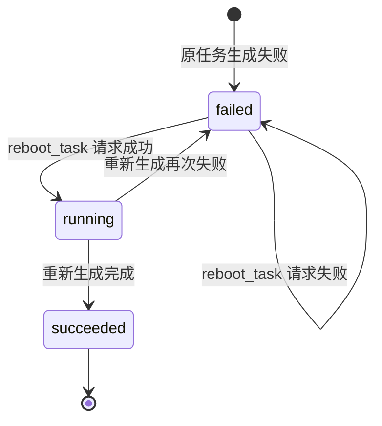
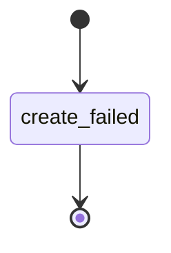
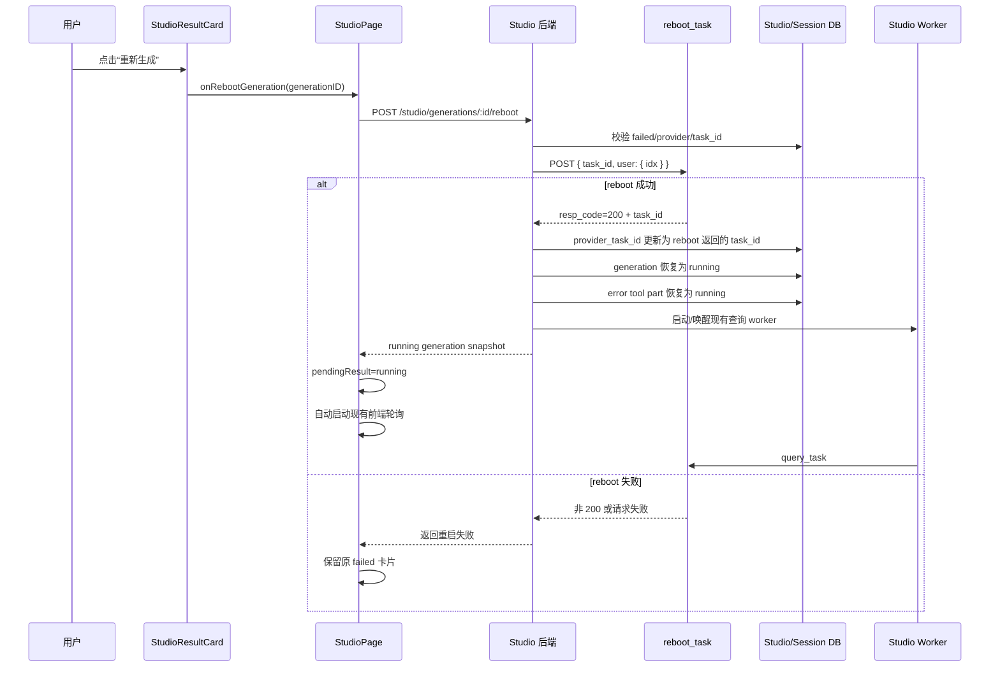

# Studio 失败任务重新生成实现方案

## 1. 背景

Studio generation 在供应商任务创建成功后，会保存：

```text
studio_generation.id
studio_generation.provider_task_id
```

后端 worker 使用 `provider_task_id` 调用 `query_task`，并将任务状态同步到：

- `studio_generation` 表。
- 当前 session 的 assistant message。
- 当前 generation 对应的 tool part。
- Studio 前端任务卡片。

任务执行失败后，Studio 状态为：

```ts
"failed"
```

此类任务已有供应商 `task_id`，可以通过新增的 `reboot_task` 接口重新启动。

创建阶段失败的任务状态为：

```ts
"create_failed"
```

该类任务没有供应商 `task_id`，不能重新生成，也不能显示重新生成按钮。

当前 `packages/opencode/src/tool/internel_image_generate.ts` 已新增：

```ts
const DEFAULT_REBOOT_TASK = "http://localhost:3000/reboot_task"
```

本方案描述如何补齐服务端重启能力、Studio API、会话状态恢复、前端按钮和轮询衔接。
本方案只描述实现方式，暂不修改业务代码。

## 2. 目标

实现失败任务重新生成能力：

1. 只允许已有供应商 `task_id` 的失败任务重新生成。
2. `create_failed` 任务不显示重新生成按钮，也不能调用重新生成接口。
3. 点击按钮后，由 Studio 服务端读取可信的 `provider_task_id`。
4. 服务端调用 `reboot_task`：

   ```http
   POST /reboot_task
   ```

5. `reboot_task` 成功后，复用原 generation 和原对话轮次。
6. 将原 generation 从 `failed` 恢复为 `running`。
7. 将原 error tool part 恢复为 running tool part。
8. 使用 `reboot_task` 返回的 `task_id` 更新 `provider_task_id`。
9. 直接进入现有 worker 和前端状态轮询，由 worker 使用该 `task_id` 调用 `query_task`。
10. 重新生成成功后，原卡片展示最新结果。
11. 重新生成再次失败时，原卡片继续显示失败并允许再次重试。

## 3. 非目标

本次不实现：

- 为重新生成创建新的 session。
- 为重新生成创建新的用户消息或对话轮次。
- 为重新生成创建新的 Studio generation ID。
- 支持 `create_failed` 任务重新生成。
- 支持 `jimeng` provider 的重新生成。
- 修改原 prompt、模型、比例、参考图等参数。
- 在重新生成前重新调用 `create_task`。
- 重新执行 LLM prompt refine。
- 进入 `createGeneration()` 或 `runGenerationCreatePipeline()`。
- 自动重试 `reboot_task`。

## 4. 核心设计决策

### 4.1 复用原 generation

推荐复用：

```text
原 studio_generation.id
原 session user/assistant message
原 tool part
```

不创建新的 generation。

原因：

- 用户点击的是当前失败卡片上的“重新生成”。
- `reboot_task` 语义是重启原供应商任务。
- 可以直接复用现有 generation 状态查询接口。
- 可以直接复用现有前端和后端轮询。
- 不会生成重复的对话轮次。

### 4.2 服务端使用 generation ID

前端点击按钮时只提交：

```text
generationID
```

不提交 `task_id` 和 `user.idx`。

服务端通过 generation 记录读取：

```ts
record.provider_task_id
generationRequest(record).input.extra?.userIdx
```

这样可以避免前端传错或篡改其他任务 ID。

### 4.3 不新增业务状态

重新生成过程中继续使用：

```ts
"running"
```

前端按钮请求期间使用独立本地状态：

```ts
rebootingGenerationIDs
```

不增加持久化状态：

```text
rebooting
```

原因是 `reboot_task` 请求通常很短。请求成功后任务立即恢复为 `running`；请求失败时仍保持
`failed`。

## 5. 状态流



创建失败不参与此状态流：



## 6. 整体调用链



## 7. 内部供应商接口实现

文件：

```text
packages/opencode/src/tool/internel_image_generate.ts
```

### 7.1 环境变量

建议支持：

```ts
const rebootTaskUrl =
  env("IMAGE_REBOOT_TASK_URL") ?? DEFAULT_REBOOT_TASK
```

这样生产环境可以覆盖当前 localhost 默认地址。

### 7.2 请求结构

请求方法：

```http
POST
```

请求体：

```json
{
  "task_id": 2222,
  "user": {
    "idx": ""
  }
}
```

类型：

```ts
type RebootTaskRequest = {
  task_id: string | number
  user: {
    idx: string
  }
}
```

`provider_task_id` 当前以字符串保存。发送时建议保持字符串，不主动转 number，避免超大 ID
精度丢失。只有供应商协议严格要求 number 时才执行受控转换。

### 7.3 响应结构

`reboot_task` 的响应结构与创建接口一致，因此可以复用响应类型：

```ts
type CreateTaskResponse
```

成功条件必须是：

```ts
response.resp_code === 200
```

成功后通过现有 `getTaskId()` 提取响应中的 task ID：

```ts
const taskId = getTaskId(response)
```

即使供应商通常返回原 task ID，也应以 reboot 响应中的 ID 为准。

这里的“复用”只表示复用响应类型和 task ID 提取逻辑，不表示回到创建流程。重新生成成功后的后续链路是：

```text
reboot_task 成功
  -> 保存 reboot 返回的 task_id
  -> generation 恢复 running
  -> worker 使用 provider_task_id 调 query_task
```

不要调用：

```text
create_task
createGeneration()
runGenerationCreatePipeline()
prompt refine
```

### 7.4 导出函数

建议新增：

```ts
export async function rebootInternalGeneration(input: {
  taskId: string
  userIdx: string
}): Promise<ImageGenerationTask>
```

请求示意：

```ts
const response = await fetch(
  env("IMAGE_REBOOT_TASK_URL") ?? DEFAULT_REBOOT_TASK,
  {
    method: "POST",
    headers: internalImageHeaders(),
    body: JSON.stringify({
      task_id: input.taskId,
      user: {
        idx: input.userIdx,
      },
    }),
    signal: controller.signal,
  },
)
```

返回：

```ts
return {
  taskId: getTaskId(json),
  provider: "internel",
  request: {
    url: rebootTaskUrl,
    method: "POST",
    body: {
      task_id: input.taskId,
      user: { idx: input.userIdx },
    },
  },
  input: originalInput,
}
```

其中 `originalInput` 不应由 `internel_image_generate.ts` 自己构造。更简单的方式是让
`rebootInternalGeneration()` 返回：

```ts
type RebootGenerationResult = {
  taskId: string
  response: CreateTaskResponse
  request: {
    url: string
    method: "POST"
    body: RebootTaskRequest
  }
}
```

然后由 `studio-service.ts` 继续保留原 generation request input。

推荐使用第二种方式，职责更清楚。

### 7.5 超时

建议增加：

```ts
const DEFAULT_REBOOT_TIMEOUT_MS = 15_000
```

环境变量：

```text
IMAGE_REBOOT_TIMEOUT_MS
```

重启接口只负责重新提交已有任务，通常不应复用创建接口的 120 秒超时。

### 7.6 错误处理

重新生成失败不会改变原任务状态。

建议统一抛出：

```text
重新生成失败，请检查网络或稍后再试
```

如果确定 reboot 接口的 `5004`、`5009` 与创建接口语义一致，也可以复用
`createTaskFailureMessage()`：

```ts
throw new Error(createTaskFailureMessage(json))
```

但这个错误只用于本次按钮请求的 toast，不应覆盖原 generation 的失败原因。

HTTP 非 2xx、非 JSON、`resp_code !== 200`、缺少 task ID 都应视为 reboot 失败。

## 8. Studio 服务端实现

文件：

```text
packages/opencode/src/studio/studio-service.ts
```

### 8.1 导入重启函数

```ts
import {
  cancelInternalGeneration,
  createInternalGeneration,
  queryInternalGeneration,
  rebootInternalGeneration,
} from "@/tool/internel_image_generate"
```

### 8.2 新增 `rebootGeneration()`

建议签名：

```ts
export async function rebootGeneration(
  id: string,
): Promise<StudioGenerationResult & { sessionID: string }>
```

第一步读取 generation：

```ts
const record = db
  .select()
  .from(StudioGenerationTable)
  .where(
    and(
      eq(StudioGenerationTable.id, id),
      eq(StudioGenerationTable.directory, Instance.directory),
    ),
  )
  .get()
```

### 8.3 校验条件

必须全部满足：

```text
record 存在
record.status === "failed"
record.provider === "internel"
record.provider_task_id 存在
```

明确拒绝：

```text
create_failed
queued
running
succeeded
jimeng
缺少 provider_task_id
```

建议错误：

```ts
if (record.status === "create_failed") {
  throw new Error(`Studio generation was not created and cannot be rebooted: ${id}`)
}
if (record.status !== "failed") {
  throw new Error(`Only failed Studio generations can be rebooted: ${id}`)
}
```

### 8.4 读取 user idx

从原请求读取：

```ts
const request = generationRequest(record)
const userIdx =
  typeof request.input.extra?.userIdx === "string"
    ? request.input.extra.userIdx
    : ""
```

不要读取当前浏览器登录态。重新生成应沿用原任务创建时保存的 user。

### 8.5 调用 reboot 接口

```ts
const reboot = await rebootInternalGeneration({
  taskId: record.provider_task_id,
  userIdx,
})
```

调用失败时：

- 不修改 generation。
- 不修改 tool part。
- 不清除原 error。
- 直接让 Studio API 返回失败。

### 8.6 原子恢复 generation

reboot 接口成功后，使用事务重新读取当前状态并更新：

```ts
const restarted = Database.transaction(
  (db) => {
    const current = db
      .select({ status: StudioGenerationTable.status })
      .from(StudioGenerationTable)
      .where(eq(StudioGenerationTable.id, id))
      .get()

    if (!current) return "missing" as const
    if (current.status !== "failed") return "conflict" as const

    db
      .update(StudioGenerationTable)
      .set({
        provider_task_id: reboot.taskId,
        status: "running",
        raw_status: null,
        progress: 0,
        queue_order: null,
        error: null,
        result: null,
        poll_attempts: 0,
        next_poll_at: Date.now(),
        completed_at: null,
        time_updated: Date.now(),
      })
      .where(
        and(
          eq(StudioGenerationTable.id, id),
          eq(StudioGenerationTable.status, "failed"),
        ),
      )
      .run()

    return "restarted" as const
  },
  { behavior: "immediate" },
)
```

必须在调用供应商后再次校验状态，避免用户连续点击、其他窗口同时重启或状态被其他请求修改。

### 8.7 并发说明

上述流程仍存在一个边界：

```text
两个请求同时读取 failed
  -> 两个请求都调用 reboot_task
  -> 只有一个请求成功更新本地 generation
```

如果供应商 reboot 接口不是幂等的，建议增加本地互斥集合：

```ts
const rebootingGenerations = new Set<string>()
```

流程：

```ts
if (rebootingGenerations.has(id)) {
  throw new Error("该任务正在重新生成")
}
rebootingGenerations.add(id)
try {
  // reboot
} finally {
  rebootingGenerations.delete(id)
}
```

更稳妥的跨进程方案是新增持久化 `rebooting` 状态，但当前需求不需要扩大状态机。桌面单进程场景下，
进程内集合足够防止重复调用。

## 9. 会话消息恢复

### 9.1 当前限制

失败后的 tool part 是：

```ts
state.status = "error"
```

当前 `loadPersistedTurn()` 只接受：

```ts
state.status === "running"
```

因此不能直接用于重新生成。

### 9.2 新增失败 turn 加载

建议新增：

```ts
function loadFailedPersistedTurn(
  record: StudioGenerationRecord,
): {
  assistantInfo: MessageV2.Assistant
  toolPart: MessageV2.ToolPart & {
    state: MessageV2.ToolStateError
  }
}
```

或者将加载函数改为返回 running/error 联合类型，再由调用方做状态收窄。

推荐单独函数，避免影响 worker 已有假设。

### 9.3 恢复 assistant message

重新生成后 assistant message 应恢复为活动工具调用：

```ts
const { completed: _, ...time } = turn.assistantInfo.time

const assistantInfo: MessageV2.Assistant = {
  ...turn.assistantInfo,
  time,
  finish: "tool-calls",
}
```

不要保留失败时的：

```ts
finish: "error"
time.completed
```

### 9.4 恢复 tool part

将同一个 tool part 更新为：

```ts
const toolPart: MessageV2.ToolPart = {
  ...turn.toolPart,
  state: {
    status: "running",
    title: "图片生成",
    input: turn.toolPart.state.input,
    metadata: {
      ...turn.toolPart.state.metadata,
      studio: {
        ...studioMetadata,
        generationID: record.id,
        status: "running",
        progress: 0,
      },
    },
    time: {
      start: restartedAt,
    },
  },
}
```

必须移除旧字段：

```text
error
time.end
metadata.statusCode
metadata.studio.rawStatus
metadata.studio.order
```

建议新增：

```ts
function restartStudioSession(input: {
  sessionID: SessionID
  turn: FailedStudioPersistedTurn
  generationID: string
  restartedAt: number
})
```

并发送：

```ts
SyncEvent.run(MessageV2.Event.Updated, ...)
SyncEvent.run(MessageV2.Event.PartUpdated, ...)
```

### 9.5 写入顺序

建议顺序：

1. reboot 供应商接口成功。
2. 原子更新 generation 为 running。
3. 恢复 assistant/tool part。
4. 更新 session `time_updated`。
5. 启动 worker。
6. 返回 generation snapshot。

如果 generation 更新成功但 session part 更新失败，前端仍可以通过 generation GET 恢复运行状态，
但刷新后对话可能暂时显示旧失败 part。实现时应记录错误并尽量补偿，不应再次调用 reboot 接口。

## 10. Studio API

### 10.1 Hono 路由

文件：

```text
packages/opencode/src/server/routes/instance/studio.ts
```

新增：

```http
POST /studio/generations/:generationID/reboot
```

实现：

```ts
.post(
  "/generations/:generationID/reboot",
  async (c) => c.json(
    await rebootGeneration(c.req.param("generationID")),
  ),
)
```

### 10.2 HttpApi 路径和 endpoint

文件：

```text
packages/opencode/src/server/routes/instance/httpapi/groups/studio.ts
```

增加路径：

```ts
generationReboot:
  `${root}/generations/:generationID/reboot`,
```

增加 endpoint：

```ts
HttpApiEndpoint.post(
  "rebootGeneration",
  StudioPaths.generationReboot,
  {
    params: {
      generationID: Schema.String,
    },
    success: described(
      StudioGenerationResult,
      "Rebooted Studio generation",
    ),
    error: [
      HttpApiError.BadRequest,
      ApiStudioGenerationError,
    ],
  },
)
```

OpenAPI：

```ts
identifier: "studio.generations.reboot"
summary: "Reboot failed Studio generation"
description: "Reboots an existing failed internal Studio generation."
```

### 10.3 HttpApi handler

文件：

```text
packages/opencode/src/server/routes/instance/httpapi/handlers/studio.ts
```

导入：

```ts
rebootGeneration
```

新增 handler：

```ts
const reboot = Effect.fn(
  "StudioHttpApi.rebootGeneration",
)(function* (ctx: {
  params: {
    generationID: string
  }
}) {
  const instance = yield* InstanceState.context
  return yield* Effect.tryPromise({
    try: () =>
      Instance.restore(
        instance,
        () => rebootGeneration(ctx.params.generationID),
      ),
    catch: (error) =>
      new ApiStudioGenerationError({
        name: "StudioGenerationError",
        data: {
          message:
            error instanceof Error
              ? error.message
              : String(error),
        },
      }),
  })
})
```

注册：

```ts
.handle("rebootGeneration", reboot)
```

### 10.4 SDK

修改 HttpApi schema 后运行：

```bash
./packages/sdk/js/script/build.ts
```

## 11. 前端状态

文件：

```text
packages/app/octoapp/pages/studio-page.tsx
```

新增：

```ts
const [
  rebootingGenerationIDs,
  setRebootingGenerationIDs,
] = createSignal<ReadonlySet<string>>(new Set())
```

使用 Set 而不是单个 boolean，避免不同历史任务卡片互相覆盖状态。

同时需要把重新生成纳入 Studio 的全局生成互斥状态。

当前会触发实际生成链路的入口包括：

- composer 发送。
- 画布区域的“再次生成”。
- 结果卡片的“重新生成”。

这些入口应共用同一类 busy 判断。只要当前 session 中存在任意任务处于生成中，或者存在任意
`reboot_task` 请求尚未完成，就不允许再发起新的生成入口。

建议在 `studio-page.tsx` 中将现有 busy 判断扩展为：

```ts
const hasRebootingGeneration = () =>
  rebootingGenerationIDs().size > 0

const hasActiveGeneration = () =>
  Boolean(
    activeGeneration()?.status === "queued" ||
      activeGeneration()?.status === "running" ||
      hasRebootingGeneration(),
  )
```

如果当前代码已有 `isBusy()`、`generating()` 或类似计算函数，应优先复用原函数，只把
`rebootingGenerationIDs().size > 0` 合并进去，不新增另一套互斥状态。

交互规则：

- 有任务正在生成时，所有历史卡片上的“重新生成”都置灰。
- 有 `reboot_task` 请求进行中时，发送、再次生成、其他卡片上的“重新生成”都置灰。
- 点击某张卡片的“重新生成”后，在 reboot 请求返回前，该卡片按钮显示“重新生成中...”。
- reboot 成功后，任务状态变为 `running`，`studio-composer-stop` 显示停止按钮。
- reboot 成功后的生成中阶段，发送、再次生成、重新生成等入口继续置灰，只保留当前任务的停止能力。

## 12. 前端请求函数

新增：

```ts
async function rebootStudioGeneration(id: string) {
  if (rebootingGenerationIDs().has(id)) return
  if (hasActiveGeneration()) return

  const current = server.current
  if (!current) {
    showToast({
      title: "重新生成失败",
      description: "No active server.",
    })
    return
  }

  setRebootingGenerationIDs((ids) =>
    new Set([...ids, id]),
  )

  try {
    const response = await fetch(
      new URL(
        `/studio/generations/${encodeURIComponent(id)}/reboot`,
        current.http.url,
      ),
      {
        method: "POST",
        headers,
      },
    )
    const bodyText = await response.text()
    if (!response.ok) {
      throw new Error(
        formatStudioGenerationError(response, bodyText),
      )
    }

    const generation =
      JSON.parse(bodyText) as StudioGenerationResult

    setPendingResult(generation)
    setStatus(generation.status)

    const sessionID = generation.sessionID ?? params.id
    if (sessionID) {
      await loadSessionMessages(sessionID)
    }
  } catch (error) {
    showToast({
      title: "重新生成失败",
      description:
        error instanceof Error
          ? error.message
          : String(error),
    })
  } finally {
    setRebootingGenerationIDs((ids) =>
      new Set(
        [...ids].filter(
          (generationID) => generationID !== id,
        ),
      ),
    )
  }
}
```

成功后 generation 状态是 `running`。现有：

```ts
pollingGenerationID
```

会自动返回该 generation ID，并进入现有 `getStudioGeneration()` 轮询，不需要新增定时器。

同时，由于该 generation 已经恢复为 `running`，现有 composer 的停止按钮逻辑应能识别到当前活动任务：

```text
reboot 成功
  -> setPendingResult(running generation)
  -> 当前 session 存在 active running generation
  -> studio-composer-stop 显示停止按钮
  -> 发送、再次生成、重新生成入口置灰
```

如果现有 `studio-composer-stop` 只依赖创建流程中的本地状态，需要补充对 reboot 后 running generation
的识别，避免出现任务已经重新生成但 composer 仍显示发送按钮的问题。

## 13. 结果卡片按钮

文件：

```text
packages/app/octoapp/pages/studio/studio-result-card.tsx
```

### 13.1 Props

新增：

```ts
rebooting: boolean
onRebootGeneration: (
  generationID: string,
) => void
```

### 13.2 显示条件

```ts
const rebootable = () =>
  status() === "failed" &&
  props.turn.result?.provider === "internel" &&
  Boolean(props.turn.result?.taskId) &&
  props.turn.result?.id.startsWith("studio_gen")
```

该条件天然排除：

- `create_failed`
- queued
- running
- succeeded
- 没有 task ID 的失败任务
- 非 internal provider
- 仅前端临时卡片

注意：不要只判断 `toolError`，必须以 `result.status === "failed"` 和 `taskId` 为准。

该按钮需要和现有“重新编辑”按钮共存：

- `重新编辑` 面向重新回填这一轮用户实际输入的提示词、参考图、模型和比例等参数。
- `重新生成` 面向已有供应商 `task_id` 的失败任务重启，调用 `reboot_task`，不重新走 LLM 和创建流程。
- `create_failed` 卡片可以显示“重新编辑”，但不能显示“重新生成”。
- `failed + provider_task_id` 卡片可以同时显示“重新编辑”和“重新生成”。
- 生成中卡片只显示“取消生成”，不显示“重新编辑”和“重新生成”。

### 13.3 按钮位置

当前结果卡片 header 的布局应固定为：

```text
left:  图标 + 标题 + 状态 + 进度条 + 百分比
right: 取消生成 / 重新编辑 / 重新生成 / 未来按钮...
```

因此“重新生成”应放在：

```text
studio-result-progress-actions
```

不要把 `studio-result-progress-status`、进度条或百分比移动到 actions 中。状态和进度仍然属于
`studio-result-progress-left`，否则生成中卡片会出现进度条被挤压、隐藏或消失的问题。

预计按钮顺序：

```text
取消生成: 仅生成中显示
重新编辑: 终态生成卡片显示，编辑能力结果不显示
重新生成: failed + internel + taskId 显示，放在“重新编辑”右侧
```

建议结构：

```tsx
<div class="studio-result-progress-header">
  <div class="studio-result-progress-left">
    <div class="studio-result-progress-title">
      ...
    </div>
    <span class="studio-result-progress-status">
      {statusLabel()}
    </span>
    <Show when={generating()}>
      <div class="studio-result-progress-track">
        ...
      </div>
      <span class="studio-result-progress-percent">
        {progress()}%
      </span>
    </Show>
  </div>

  <div class="studio-result-progress-actions">
    <Show when={generating() && cancellable()}>
      <button
        type="button"
        class="studio-result-action studio-result-cancel"
        disabled={props.cancelling}
      >
        {props.cancelling ? "取消中..." : "取消生成"}
      </button>
    </Show>

    <Show when={editable()}>
      <button
        type="button"
        class="studio-result-action studio-result-edit"
      >
        重新编辑
      </button>
    </Show>

    <Show when={rebootable()}>
      <button
        type="button"
        class="studio-result-action studio-result-reboot"
        disabled={props.rebooting || props.busy}
        onClick={() =>
          props.turn.result &&
          props.onRebootGeneration(props.turn.result.id)
        }
      >
        {props.rebooting ? "重新生成中..." : "重新生成"}
      </button>
    </Show>
  </div>
</div>
```

### 13.4 样式

建议复用现有结果卡片操作按钮基础样式，保证点击区域收敛到文案宽度：

```css
.studio-result-progress-actions {
  display: flex;
  align-items: center;
  gap: 12px;
  flex: 0 0 auto;
  margin-left: auto;
}

.studio-result-action {
  width: max-content;
  padding: 0;
  border: 0;
  background: transparent;
  font-size: 12px;
  line-height: 24px;
  white-space: nowrap;
}
```

`studio-result-reboot` 只作为语义 class 或差异化颜色 hook，不要再单独设置 `margin-left: auto`。
actions 容器已经负责整体贴右，单个按钮继续设置 `margin-left: auto` 会破坏按钮组顺序和间距。

如果 `props.rebooting` 为 true，建议禁用“重新生成”。也可以同步禁用同一卡片上的“重新编辑”，避免
reboot 请求尚未落库时用户又回填旧失败任务参数。请求成功后卡片状态会变为 `running`，此时右侧只显示
“取消生成”。

这里的禁用不只看当前卡片自己的 `props.rebooting`，还要看 Studio 全局 busy 状态：

- 任意任务正在 `queued` 或 `running` 时，所有失败卡片上的“重新生成”都置灰。
- 任意 `reboot_task` 请求进行中时，所有发送、再次生成、重新生成入口都置灰。
- 当前卡片处于 `props.rebooting` 时，文案显示“重新生成中...”。
- 其他卡片因全局 busy 被禁用时，文案仍显示“重新生成”，只置灰即可。

注意区分卡片里的“重新生成”和画布区域可能存在的“再次生成”：本方案中的“重新生成”是
`reboot_task`，只重启已有供应商任务；“再次生成”如果是重新发起一次生成，则属于另一个流程，不能复用
本按钮逻辑。

## 14. 组件事件链

### 14.1 `StudioConversation`

文件：

```text
packages/app/octoapp/pages/studio/studio-conversation.tsx
```

新增 props：

```ts
rebootingGenerationIDs: ReadonlySet<string>
onRebootGeneration: (
  generationID: string,
) => void
```

传给卡片：

```tsx
<StudioResultCard
  ...
  busy={isBusy()}
  rebooting={Boolean(
    turn.result &&
    props.rebootingGenerationIDs.has(
      turn.result.id,
    )
  )}
  onRebootGeneration={
    props.onRebootGeneration
  }
/>
```

### 14.2 `StudioPage`

传递：

```tsx
<StudioConversation
  ...
  rebootingGenerationIDs={
    rebootingGenerationIDs()
  }
  onRebootGeneration={(generationID) =>
    void rebootStudioGeneration(generationID)
  }
/>
```

完整事件链：

```text
StudioResultCard
  -> StudioConversation
  -> StudioPage
  -> POST /studio/generations/:id/reboot
```

`busy` 应沿用发送、再次生成等入口使用的同一个全局生成状态，不能在 `StudioResultCard` 内部重新计算
一套局部 busy。这样才能保证：

- 正在普通生成时，历史失败卡片的“重新生成”置灰。
- 正在 reboot 请求时，composer 发送和画布“再次生成”置灰。
- reboot 成功进入 running 后，composer 停止按钮显示，其他生成入口继续置灰。

## 15. 前端状态合并注意事项

### 15.1 清除旧 error

`StudioResultCard.status()` 当前优先判断：

```ts
if (props.turn.toolError || props.turn.result?.error) {
  return "failed"
}
```

因此重启成功后必须同时满足：

```text
generation.error 被清空
session tool part 从 error 更新为 running
```

否则即使 generation 的 `status` 已为 `running`，卡片仍可能被旧 error 强制显示为失败。

### 15.2 pending 与真实 turn 合并

重启接口成功后：

```ts
setPendingResult(generation)
```

`displayTurns()` 应将同一 generation ID 的 pending result 覆盖到原失败 turn。

如果发现当前合并逻辑只针对 `toolRunning` 的真实 turn生效，需要增加：

```text
pending.id === turn.result.id
```

的明确覆盖分支。

建议为此增加单元测试，避免出现：

```text
pendingResult 已 running
但历史 turn 仍显示 failed
```

### 15.3 重新加载消息

后端更新 tool part 后，前端通常会收到 event。仍建议在 reboot 成功后主动：

```ts
loadSessionMessages(sessionID)
```

用于覆盖事件丢失或路由切换时序。

## 16. 轮询衔接

重新生成的轮询衔接点是 `reboot_task` 成功之后。

服务端只做两件事：

1. 将 `reboot_task` 返回的 `task_id` 保存回原 generation 的 `provider_task_id`。
2. 将原 generation 恢复为 `running`，并设置 `next_poll_at` 让现有 worker 尽快查询。

之后由现有 worker 直接使用该 `provider_task_id` 调用 `query_task`。不要重新走创建链路，也不要重新执行
LLM prompt refine。

现有前端轮询条件：

```ts
active.status === "queued" ||
active.status === "running"
```

重启成功后返回：

```ts
status: "running"
```

因此会自动：

1. 获取 generation ID。
2. 立即调用一次 `GET /studio/generations/:id`。
3. 按既有间隔继续查询。
4. 成功或失败后停止轮询。

后端 worker 同样扫描：

```ts
status IN ("queued", "running")
next_poll_at <= now
```

重启成功后设置：

```ts
next_poll_at: Date.now()
```

即可重新进入 worker。

## 17. 失败行为

### 17.1 reboot 请求失败

保持原状态：

```ts
status: "failed"
error: 原生成失败原因
completed_at: 原完成时间
```

前端只显示 toast：

```text
重新生成失败
{reboot 接口错误}
```

不要用 reboot 错误覆盖卡片中的原生成失败原因。

### 17.2 重启后再次生成失败

worker 沿用现有：

```ts
failGeneration()
```

更新：

```text
status=failed
error=新的生成失败原因
completed_at=新的失败时间
```

卡片重新显示“重新生成”按钮。

### 17.3 用户取消的任务

用户取消后的任务是否能重新生成，只看是否已经拿到了供应商 `task_id`。

如果取消发生在最终生成接口返回 `task_id` 之前，任务状态是：

```text
status=create_failed
raw_status=4
provider_task_id 不存在
```

这种任务不能重新生成，也不显示“重新生成”按钮。

如果取消发生在最终生成接口返回 `task_id` 之后，任务状态是：

```text
status=failed
raw_status=4
provider_task_id 存在
```

这种任务可以重新生成，和 worker 轮询发现的供应商失败一致。

因此，`raw_status=4` 只用于说明失败原因是“用户取消”，不参与“重新生成”按钮显示和服务端重启校验。

按钮和服务端校验都不要增加 `record.raw_status !== "4"` 之类的条件，否则会错误排除已经有
`task_id` 的取消任务。

## 18. 测试方案

### 18.1 内部接口测试

验证：

1. 请求方法为 POST。
2. 请求体包含：

   ```json
   {
     "task_id": "2222",
     "user": {
       "idx": ""
     }
   }
   ```

3. `resp_code=200` 且有 task ID 时成功。
4. `resp_code!==200` 时失败。
5. HTTP 非 2xx 时失败。
6. 非 JSON 时失败。
7. 缺少 task ID 时失败。
8. 网络错误和超时时失败。

### 18.2 服务端测试

验证：

1. failed + internel + task ID 可以重启。
2. create_failed 被拒绝。
3. failed 但无 task ID 被拒绝。
4. queued/running/succeeded 被拒绝。
5. jimeng 被拒绝。
6. 请求使用原 generation 保存的 userIdx。
7. reboot 失败时 generation 和 tool part 不变化。
8. reboot 成功时：
   - status 为 running。
   - provider task ID 使用响应 task ID。
   - progress 归零。
   - raw status 清空。
   - queue order 清空。
   - error 清空。
   - result 清空。
   - completed time 清空。
   - poll attempts 归零。
   - next poll time 可立即执行。
9. assistant message 从 error 恢复为 tool-calls。
10. tool part 从 error 恢复为 running。
11. worker 可以重新查询。
12. 并发点击最多调用一次 reboot 接口。
13. failed + raw_status=4 + task ID 可以重启。
14. create_failed + raw_status=4 + 无 task ID 被拒绝。

### 18.3 前端测试

验证按钮：

1. failed + taskId + internel 显示。
2. create_failed 不显示。
3. failed 但无 taskId 不显示。
4. running/queued/succeeded 不显示。
5. jimeng 不显示。
6. 点击时传 generation ID，不传 task ID。
7. 请求期间按钮禁用并显示“重新生成中...”。
8. 成功后卡片进入生成中。
9. 成功后现有轮询启动。
10. 请求失败后保留原失败卡片。
11. 请求失败后显示 toast。
12. failed + rawStatus=4 + taskId 显示。
13. create_failed + rawStatus=4 + 无 taskId 不显示。
14. failed + taskId + internel 同时显示“重新编辑”和“重新生成”。
15. “重新生成”位于“重新编辑”右侧。
16. 生成中只显示“取消生成”，不显示“重新编辑”和“重新生成”。
17. 生成中 header 仍显示进度条和百分比，不能因为 actions 分组导致进度条消失。
18. `create_failed` 可以显示“重新编辑”，但不显示“重新生成”。
19. “重新生成”点击区域收敛到文字宽度，不因 flex 布局撑满右侧空白区域。
20. 任意任务正在 queued/running 时，历史卡片上的“重新生成”置灰。
21. 任意 `reboot_task` 请求进行中时，composer 发送、画布“再次生成”和其他卡片“重新生成”置灰。
22. 点击“重新生成”成功进入 running 后，`studio-composer-stop` 显示停止按钮。
23. reboot 后 running 阶段，composer 发送和画布“再次生成”继续置灰。

### 18.4 手工验证

1. 制造一个已有 task ID 的生成失败任务。
2. 确认卡片 header 右侧显示“重新编辑”和“重新生成”，且“重新生成”位于“重新编辑”右侧。
3. 点击按钮。
4. 检查 reboot 请求 body。
5. 成功后卡片立即恢复为生成中，右侧只显示“取消生成”。
6. 检查前端 GET generation 轮询。
7. 检查后端 query task 轮询。
8. 重新生成成功后原卡片展示结果。
9. 刷新页面后结果仍正确。
10. 制造 `create_failed` 任务，确认没有“重新生成”，但仍可按“重新编辑”的规则显示回填按钮。
11. 取消一个已拿到 task ID 的任务，确认失败卡片仍显示“重新生成”。
12. 取消一个未拿到 task ID 的任务，确认失败卡片不显示“重新生成”。
13. 制造一个运行中的生成任务，确认 left 区域仍是图标、标题、状态、进度条、百分比，right 区域是取消按钮。
14. 在任意任务生成中时查看历史失败卡片，确认“重新生成”置灰且不能点击。
15. 点击失败卡片“重新生成”，确认 reboot 请求期间发送、再次生成、其他“重新生成”入口都置灰。
16. reboot 成功后确认 composer 显示停止按钮，停止按钮可以取消这次重新生成后的任务。

## 19. 实施顺序

建议：

1. 在 `internel_image_generate.ts` 实现 `rebootInternalGeneration()`。
2. 在 `studio-service.ts` 实现失败 turn 加载和 `restartStudioSession()`。
3. 实现 `rebootGeneration()` 和并发保护。
4. 增加 Hono reboot 路由。
5. 增加 HttpApi path、endpoint 和 handler。
6. 重新生成 JS SDK。
7. 在 `StudioPage` 增加请求和 loading Set。
8. 扩展 `StudioConversation` 事件链。
9. 在 `StudioResultCard` 增加按钮和样式。
10. 补充 pending/真实 turn 合并逻辑。
11. 增加内部接口、服务端和前端测试。
12. 从各包目录运行测试和 typecheck。

## 20. 验收标准

完成后必须满足：

```text
已有 task ID 的 failed 任务
  -> 显示“重新生成”
  -> 点击后调用 reboot_task
  -> 保存 reboot_task 返回的 task ID
  -> 成功后原任务恢复 running
  -> 自动进入现有轮询
  -> worker 使用 provider_task_id 调 query_task
  -> 最终更新为 succeeded 或 failed
```

同时：

- `create_failed` 永远不显示重新生成按钮。
- `failed + provider_task_id` 永远显示重新生成按钮，即使 `raw_status=4`。
- `failed + provider_task_id` 可以同时显示“重新编辑”和“重新生成”，其中“重新生成”位于“重新编辑”右侧。
- 生成中卡片的 header 仍按 `left: 图标 + 标题 + 状态 + 进度条 + 百分比`、`right: 操作按钮` 分组。
- 当前 session 有任意任务生成中时，所有新生成入口置灰，包括发送、再次生成和历史卡片“重新生成”。
- 点击“重新生成”后，reboot 请求中也计入全局 busy，不能并发触发发送、再次生成或其他重新生成。
- reboot 成功进入 running 后，`studio-composer-stop` 显示停止按钮，并复用现有取消生成链路。
- 前端不提交 task ID。
- 服务端只使用数据库中的 provider task ID。
- reboot 成功后只进入 `query_task` 轮询链路，不调用 `create_task`。
- reboot 不执行 LLM prompt refine，不进入 `createGeneration()` 或 `runGenerationCreatePipeline()`。
- reboot 失败不覆盖原任务失败原因。
- 不创建新的 session、generation 或对话轮次。
- 不新增重复轮询机制。
- 重复点击不会重复调用供应商 reboot 接口。
